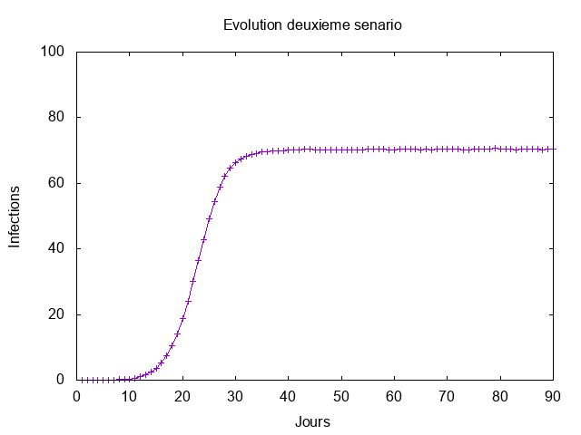

# Rapport de TP - Ri

|Année|Filière|Matière|TP|Sujet |Réalisé par|
|--|--|--|--|--|--|
| 2021-2022 | M1 IWOCS | RI |Tp 2 et 3| Mesure et Propagation | Ait Hammi Massinissa |


## Plan

* [Mesures de reseaux d'interaction](#Mesures)
  * [Question1](#Question1)
  * [Question2](#Question2)
  * [Question3](#Question3)
  * [Question4](#Question4)
  * [Question5](#Question5)
  * [Question6](#Question6)
  * [Question7](#Question7)
* [Propagation](#Propagation)
  * [Rappelle du sujet](#Propagation)
  * [Question1](#Question1_propagation)
  * [Question2](#Question2_propagation)
  * [Question3](#Question3_propagation)
  * [Question4](#Question4_propagation)
  * [Question5](#Question5_propagation)

</br></br></br>
<div id="Mesures" align="center">
<h1>Mesures de reseaux d interaction</h1>
</div>

Nous allons analyser un réseau de collaboration scientifique en informatique. Le réseau est extrait de DBLP et disponible sur [SNAP](https://snap.stanford.edu/data/com-DBLP.html).

GraphStream permet de mesurer de nombreuses caractéristiques d'un réseau. La plupart de ces mesures sont implantées comme des méthodes statiques dans la classe [`Toolkit`](https://data.graphstream-project.org/api/gs-algo/current/org/graphstream/algorithm/Toolkit.html). Elles vous seront très utiles par la suite.

<div id="Question1" align="center">
</div>

## 1. Commencez par télécharger les données et les lire avec GraphStream. GraphStream sait lire ce format. Voir [`FileSourceEdge`](https://data.graphstream-project.org/api/gs-core/current/org/graphstream/stream/file/FileSourceEdge.html) et ce [tutoriel](http://graphstream-project.org/doc/Tutorials/Reading-files-using-FileSource/). Vous pouvez essayer de visualiser le graphe mais pour cette taille ça sera très lent et très peu parlant.

**DONE**
</br>
</br>
</br>
<div id="Question2" align="center">
</div>

## 2. Prenez quelques mesures de base: nombre de nœuds et de liens, degré moyen, coefficient de clustering. Quel sera le coefficient de clustering pour un réseau aléatoire de la même taille et du même degré moyen ?

- **Nombre de nœuds** : 317080
- **Nombre d'arêtes** :     1049866
- **Degré moyen**: 6.62208890914917
- **Coefficient de clustering Moyen** : 0.6324308280637396
- **Moyenne de Coefficient de clustering dans un reseau aleatoire** : 2.0884599814397534E-5

   Le coefficient de clustering pour un réseau aléatoire de même taille et de même degré moyen sera le même
   Il  calcule la probabilité p qu'un noeud soit relié à un autre noeud du réseau.
   On applique la formule p = degré moyen /nombre de noeuds 
   
 <div id="Question3" align="center">
</div>

## 3. Le réseau est-il connexe ? Un réseau aléatoire de la même taille et degré moyen sera-t-il connexe ? À partir de quel degré moyen un réseau aléatoire avec cette taille devient connexe ?

 - **Le réseau est connexe ?** :  Vrai
- **Un réseau aléatoire de la même taille et degré moyen sera-t-il connexe (regime connected) ?** :  Faux

 
   
   La formule pour déterminer si un graphe aléatoire est connexe est degré moyen /ln(nombre de noeuds) > 1, 
  
  <div id="Question4" align="center">
</div>

## 4. Calculez la distribution des degrés et tracez-la avec `gnuplot` (ou avec votre outil préféré) d'abord en échelle linéaire, ensuite en échelle log-log. Est-ce qu'on observe une ligne droite en log-log ? Que cela nous indique ? Tracez la distribution de Poisson avec la même moyenne pour comparaison. Utilisez la commande `fit` de `gnuplot` pour trouver les coefficients de la loi de puissance et tracez-la.


La distribution de degrés $`p_k = \frac{N_k}{N}`$ est la probabilité qu'un nœud choisi au hasard ait degré $`k`$. On peut utiliser [`degreeDistribution()`](https://data.graphstream-project.org/api/gs-algo/current/org/graphstream/algorithm/Toolkit.html#degreeDistribution(org.graphstream.graph.Graph)) de la classe [`Toolkit`](https://data.graphstream-project.org/api/gs-algo/current/org/graphstream/algorithm/Toolkit.html) pour obtenir $`N_k`$ et normaliser par la suite et le printWriter pour stocker les données dans un fichier dat "DistributionDegree.dat":

```java
   private static void ecrituredonnees(Graph graphe) {
    	File fichier = new File("src/main/resources/DistributionDegree.dat");
    	  try{
              System.out.println("\n Ecriture des données sur : \n "+fichier);
              PrintWriter printWriter = new PrintWriter(fichier, "UTF-8");
              int[] degredistribution = Toolkit.degreeDistribution(graphe);
              for (int k = 0; k < degredistribution.length; k++) {
                  if (degredistribution[k] != 0) {
                  	printWriter.write(String.format(Locale.US, "%6d%20.8f%n", k, (double)degredistribution[k] / graphe.getNodeCount()));
                  }
              }
              printWriter.close();
          	} catch(IOException e) {
          e.printStackTrace();
          	}
    }
```
- On utilise ce [script](src/main/resources/TPMesure/script_distribution_degree_linéaire.gnuplot) pour tracer la distribution de degrés en échelle **lineaire** :


- On utilise ce [script](src/main/resources/TPMesure/script_distribution_degree_loglog.gnuplot) pour traçer la distribution de degrés en échelle **log-log** avec :


(*) En traçant la distribution de degrés en échelle log-log On **observe une ligne droite** pendant plusieurs ordres de grandeur. Cela nous indique **une loi de puissance** :

```math
    p_k = C k^{-\gamma}
```

 - On utilise ce [script](src/main/resources/TPMesure/script_loi_poisson.gnuplot) pour tracer **la distribution de Poisson** : 
 
  


- Enfin on utilise ce [script](src/main/resources/TPMesure/script_loi_puissance_compa.gnuplot) pour tracer les **3 distributions** et estimer **l'exposant de la loi de puissance**.

    

    On a $`\gamma = 2.7 \pm 0.04`$


<div id="Question5" align="center">
</div>

## 5. Maintenant on va calculer la distance moyenne dans le réseau. Le calcul des plus courts chemins entre toutes les paires de nœuds prendra plusieurs heures pour cette taille de réseau. C'est pourquoi on va estimer la distance moyenne par échantillonnage en faisant un parcours en largeur à partir de 1000 sommets choisis au hasard. L'hypothèse des six degrés de séparation se confirme-t-elle ? Est-ce qu'il s'agit d'un réseau petit monde ? Quelle sera la distance moyenne dans un réseau aléatoire avec les mêmes caractéristiques ? Tracez également la *distribution* des distances. Formulez une hypothèse sur la loi de cette distribution.

  - Générer 1000 sommets au hasard :
   [`randomNodeSet(Graph g , double NombredeRandom)`](https://data.graphstream-project.org/api/gs-algo/current/org/graphstream/algorithm/Toolkit.html#randomNodeSet(org.graphstream.graph.Graph,%20double))
  - creer deux variables distance et nombre 
  
  - Parcourir le graphe a partir chaque noeud : ['BreadthFirstIterator'](https://data.graphstream-project.org/api/gs-core/current/org/graphstream/graph/BreadthFirstIterator.html) Ajouter avec avec l'iterateur la variable 'distance'tout en incrementant la variable 'nombre' dans chaque iteration 
  
  
```math
    d_k = distance/nombre
```
   (*) On trouve la **distance moyenne** = 6.832146880913334
  
  
 -  L'hypothèse des six degrés de séparation se confirme-t-elle ? : Non 
 distance moyenne > 6
   
 - Est-ce qu'il s'agit d'un réseau petit monde ? Non 
  l'hypothèse des six degrés est fausse .
 -  Quelle sera la distance moyenne dans un réseau aléatoire avec les mêmes caractéristiques ? :
 
 la distance moyenne dans un reseau aleatoire:
$`
  \frac {ln(N)}{ln(Moyenne de degree) } = 6.700611818856679
  
`$


- On utilise ce [script](src/main/resources/TPMesure/script_distribution_distance.gnuplot) pour tracer la **distributions de distance** : 

 
  
  - Elle suit une lois de **une loi de poisson** 


   <div id="Question6" align="center">
</div>


## 6. Utilisez les générateurs de GraphStream pour générer un réseau aléatoire et un réseau avec la méthode d'attachement préférentiel (Barabasi-Albert) qui ont la même taille et le même degré moyen. Refaites les mesures des questions précédentes pour ces deux réseaux. Les résultats expérimentaux correspondent-ils aux prédictions théoriques ? Comparez avec le réseau de collaboration. Que peut-on conclure ?


**Reseau Random**

-  **Nombre de nodes reseau aleatoire :** 317080
-  **Nombre de edges reseau aleatoire  :**  951315
-  **Moyenne des degree reseau aleatoire :** 6.0004730224609375
-  **Moyenne de coefficient de clustering reseau aleatoire :** 2.7090549688815048E-5**
-  **le reseau aleatoire est connexe ?  :** false
-  **Distance moyenne reseau aleatoire ? :** 7.069225702089277
        
**Reseau BarabasiAlbert**

-  **Nombre de nodes reseau Barabasi Albert :** 317080
-  **Nombre de edges reseau Barabasi Albert  :** 1107635
-  **Moyenne des degree reseau Barabasi Albert :** 6.9864702224731445
-  **Moyenne de coefficient de clustering reseau Barabasi Albert   :** 4.209522621140351E-4
-  **le reseau Barabarasi Albert est connexe ? :** true
-  **Distance moyenne reseau Barabarasi ? :** 4.988950037398195

<div id="Question7" align="center">
</div>

## 7. Question bonus : S'il y a une caractéristique du réseau de collaboration que le modèle de Barabasi-Albert n'arrive pas à reproduire c'est le coefficient de clustering. Est-ce qu'on peut espérer faire mieux avec une variante de la méthode de copie :

    * Le nouveau nœud choisit au hasard un nœud `v`.
    * Ensuite il parcourt tous les voisins de `v` et se connecte à eux avec probabilité `p`.
    * À la fin il se connecte à `v`

    Essayez d'implanter un tel générateur et voir les résultats qu'il donne.

    **TODO**

</br></br></br></br></br></br></br>

<div id="Propagation" align="center">
<h1>Propagation</h1>
</div>

# Rappelle du sujet 

Les consignes sont les mêmes que pour le premier [`TP`](https://eureka.univ-lehavre.fr/mod/assign/view.php?id=26242). On travaille sur les mêmes [`données`](https://snap.stanford.edu/data/com-DBLP.html) et la problématique est proche. Utilisez donc le même dépôt sur la forge ([`Lien`](https://www-apps.univ-lehavre.fr/forge/am184100/tpnotemesure)).

Nos collaborateurs scientifiques communiquent souvent par mail. Malheureusement pour eux, les pièces jointes de ces mails contiennent parfois des virus informatiques. On va étudier la propagation d'un virus avec les hypothèses suivantes

* Un individu envoie en moyenne un mail par semaine à chacun de ses collaborateurs.
* Un individu met à jour son anti-virus en moyenne deux fois par mois. Cela nettoie son système mais ne le protège pas de nouvelles infections car le virus mute.
* L'épidémie commence avec un individu infecté (patient zéro).


1.  **Quel est le taux de propagation du virus ? Quel est le seuil épidémique du réseau ? Comparez avec le seuil théorique d'un réseau aléatoire du même degré moyen**
2. **Simulez la propagation du virus jour par jour pendant trois mois avec les scénarios suivants :**

    * On ne fait rien pour empêcher l'épidémie
    * On réussit à convaincre 50 % des individus de mettre à jour en permanence leur anti-virus (immunisation aléatoire)
    * On réussit à convaincre 50 % des individus de convaincre un de leurs contacts de mettre à jour en permanence son anti-virus (immunisation sélective).
    
Pour chacun des trois scénarios, tracez l'évolution de la fraction d'infectés de la population non immunisée. Que peut-on conclure ?
    <h3 style="color:#a8a4a4;font-weight: bold;">
    Attention! : La réalisation d'un scénario autour des valeurs critiques est sensible aux conditions initiales. Simulez plusieurs fois chaque scénario afin d'identifier le déroulement typique.
    </h3>

3. Pour justifier l'efficacité de l'immunisation sélective, calculez le degré moyen des groupes 0 et 1. Comment expliquez-vous la différence ?

4. Du point de vue du virus l'immunisation d'un nœud est équivalente à sa suppression du réseau. Calculez le seuil épidémique du réseau modifié pour chacune des deux stratégies d'immunisation et comparez avec le seuil épidémique du réseau initial.

5. Simulez l'épidémie avec les mêmes hypothèses et les mêmes scénarios dans un réseau aléatoire et un réseau généré avec la méthode d'attachement préférentiel de la même taille et le même degré moyen. Comparez et commentez les résultats.


</br></br>

<div id="Question1_propagation" align="center">
</div>

## ***Taux de propagation du virus:***
</br>
Taux de propagation du virus : 

```math
lambda = beta/mu.
```
Probabilité de contaminé un collaborateur: 
```math
beta = 1/7
```

Probabilité de mettre a jour son anti-virus:

```math
mu = 1/14
```


Donc Le taux de propagation :
```math
lambda =beta/mu = 2
```

Seuil épidémique du réseau:

```math
  lambda c= <k>/<k²>
```
avec 
```math
<k>= 6.62  ,  <k²> = 144.6
```
donc le seuil est 

```math
\lambda c = 6.62/144.63= 0.046
```

Comparez avec le seuil théorique d'un réseau aléatoire du même degré moyen:
calculer 
```math
<k>+1=6.62+1=7.62
```
```math
 lambda c = 1/<k>+1= 1/7.62 ≈  0.131
```
donc
```math
 lambda c ≈ 0.131 > 0.046
```

</br></br></br>

<div id="Question2_propagation" align="center">
</div>

## **Simulez la propagation du virus jour par jour pendant trois mois avec les scénarios suivants** 
</br>

#### ***Différent script utiliser pour tracer les graph***
</br>

* Script 1
Script gnuplot pour pouvoir tracer le graph [Script senario 1](src/main/resources/TpPropagation/Donnee_Barabasi/premier_senario.gnuplot)

* Script 2
Script gnuplot pour pouvoir tracer le graph [Script senario 2](src/main/resources/TpPropagation/Donnee_Barabasi/deuxieme_senario.gnuplot)

* Script 3
Script gnuplot pour pouvoir tracer le graph [Script senario 2](src/main/resources/TpPropagation/Donnee_Barabasi/troisieme_senario.gnuplot)

#### ***On ne fait rien pour empêcher l'épidémie***


#### ***On réussit à convaincre 50 % des individus de mettre à jour en permanence leur anti-virus (immunisation aléatoire)***


#### ***On réussit à convaincre 50 % des individus de convaincre un de leurs contacts de mettre à jour en permanence son anti-virus (immunisation sélective)***


</br></br></br>


<div id="Question3_propagation" align="center">
</div>


## ***Pour justifier l'efficacité de l'immunisation sélective, calculez le degré moyen des groupes 0 et 1. Comment expliquez-vous la différence ?***
```math
   groupe 0 : 

 <k>= 9.12160968840671
```
```math
   groupe 1 :  

<k> = 28.722770278793995
```
<h3 style="color:#a8a4a4;font-weight: bold;">
Dû au résultat obtenu pour le groupe 1 on peut considérer que les membres du groupe 1 forment une plus grande protection (il ont une probabilité élevé d'avoir été immunisés grâce à un de leurs voisins)
</h3>
</br></br></br>

<div id="Question4_propagation" align="center">
</div>

## ***Du point de vue du virus l'immunisation d'un nœud est équivalente à sa suppression du réseau. Calculez le seuil épidémique du réseau modifié pour chacune des deux stratégies d'immunisation et comparez avec le seuil épidémique du réseau initial.***
</br>

***seuil épidémique réseau initial*** : 0.046

***seuil épidémique (aléatoire)*** : 0.09036468432200091

***seuil épidémique (selective)*** : 0.1403597137029978

<h3 style="color:#a8a4a4;font-weight: bold;">
plus le seuil est grand plus le type d'immunisation est efficace.
Donc l'immunisation sélective est la plus efficace.
</h3>
</br></br></br>

<div id="Question5_propagation" align="center">
</div>

## ***Simulez l'épidémie avec les mêmes hypothèses et les mêmes scénarios dans un réseau aléatoire et un réseau généré avec la méthode d'attachement préférentiel de la même taille et le même degré moyen. Comparez et commentez les résultats.***

</br>

## Graphe Aleatoire

### Scénario 1


### Scénario 2


### Scénario 3


### Seuil Graphe Aleatoire

seuil épidémique (aléatoire) : 0.16701713282286157

seuil épidémique (sélective) : 0.15241080514332253


## Simulation Graphe Barabasi-Albert
</br>

### Scénario 1

* Graph en image 


### Scénario 2

* Graph en image 


### Scénario 3


### Seuil Graphe Barabasi-Albert

seuil épidémique (aléatoire) : 0.05640500714838211

seuil épidémique (sélective) :  0.18416035459513702


# Conclusion

On peut donc remarquer que l'immunité aléatoire est plus efficace dans les graphes aléatoires. 

graph aleatoire > graph Barabasi-Albert
```math
0.16701713282286157>0.05640500714838211
```

Alors que l'immunisation sélective est plus efficace dans le diagramme de Barabasi-Albert.

graph Barabasi-Albert > graph aleatoire 
```math
0.18416035459513702>0.15241080514332253
```